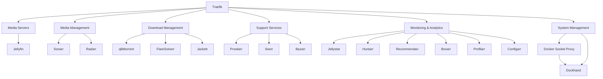

# Services Guide

## Overview

### Service Categories

1. Media Servers
2. Media Management
3. Download Management
4. System Management
5. Support Services
6. Monitoring & Analytics
7. Security Infrastructure

## Media Servers

### Jellyfin Media Server

- **Purpose**: Primary media streaming server
- **URL**: `http://jellyfin.<domain>`
- **Port**: 8096
- **Features**:
  - Media streaming
  - Live TV & DVR
  - User management
  - Remote access
  - Hardware transcoding
  - No subscription required
- **Configuration**:
  ```yaml
  volumes:
    - ${CONFIG_ROOT}/jellyfin:/config
    - ${STORAGE_ROOT}/MOVIES:${MOVIES_PATH}:ro
    - ${STORAGE_ROOT}/SERIES:${SERIES_PATH}:ro
    - ${STORAGE_ROOT}/AUDIO:${MUSIC_PATH}:ro
    - ${STORAGE_ROOT}/BOOKS:${BOOKS_PATH}:ro
  ```

## Media Management

### Sonarr

- **Purpose**: TV Series management
- **URL**: `http://sonarr.<domain>`
- **Port**: 8989
- **Features**:
  - TV show tracking
  - Episode downloading
  - Quality management
  - Release profiles
- **Integration**:
  - Prowlarr for indexers
  - qBittorrent for downloads
  - Jellyfin for updates

### Radarr

- **Purpose**: Movie management
- **URL**: `http://radarr.<domain>`
- **Port**: 7878
- **Features**:
  - Movie tracking
  - Quality profiles
  - Custom formats
  - Release management

## Download Management

### qBittorrent

- **Purpose**: Torrent client
- **URL**: `http://qbittorrent.<domain>`
- **Port**: 8080
- **Features**:
  - Category management
  - RSS automation
  - Sequential downloads
  - Web interface
- **Configuration**:
  ```yaml
  environment:
    - WEBUI_PORT=8080
  volumes:
    - ${CONFIG_ROOT}/qbittorrent:/config
    - ${STORAGE_ROOT}/TORRENTS:${DOWNLOADS_PATH}
  ```

### FlareSolverr

- **Purpose**: Cloudflare bypass
- **URL**: `http://flaresolverr.<domain>`
- **Port**: 8191
- **Features**:
  - Cloudflare protection bypass
  - Browser automation
  - API interface

### Jackett

- **Purpose**: Indexer proxy and aggregator
- **URL**: `http://jackett.<domain>`
- **Port**: 9117
- **Features**:
  - Indexer aggregation
  - Tracker support
  - API interface
  - Dark theme via theme.park
- **Configuration**:
  ```yaml
  environment:
    - DOCKER_MODS=ghcr.io/themepark-dev/theme.park:jackett
    - TP_THEME=nord
  volumes:
    - ${CONFIG_ROOT}/jackett:/config
  ```

## System Management

### Dockhand

- **Purpose**: Container management
- **URL**: `http://dockhand.<domain>`
- **Port**: 8000
- **Features**:
  - Container control
  - Resource monitoring
  - Stack management
  - Image updates
  - Lightweight alternative to Portainer
- **Security**: Connects via Docker Socket Proxy for restricted access
- **Configuration**:
  ```yaml
  environment:
    - DOCKER_HOST=tcp://docker-socket-proxy:2375
  ```

### Traefik

- **Purpose**: Reverse proxy
- **URL**: `http://traefik.<domain>`
- **Port**: 80
- **Version**: v3.3
- **Features**:
  - Automatic SSL
  - Service discovery
  - Load balancing
  - Middleware support
- **Configuration**:
  ```yaml
  command:
    - --api.dashboard=true
    - --providers.docker=true
    - --entrypoints.web.address=:80
    - --core.defaultRuleSyntax=v2
  ```

### WUD (What's Up Docker)

- **Purpose**: Container update monitoring
- **URL**: `http://wud.<domain>`
- **Port**: 3000
- **Features**:
  - Container update detection
  - Web UI dashboard
  - Notification integrations
  - Scheduled checks
- **Configuration**:
  ```yaml
  environment:
    - WUD_WATCHER_LOCAL_CRON=0 0 4 * * *
  ```

## Support Services

### Seerr

- **Purpose**: Media requests
- **URL**: `http://seerr.<domain>`
- **Port**: 5055
- **Features**:
  - Request management
  - User access control
  - Jellyfin/Emby integration
  - Notification system
  - Dark theme support via theme.park

### Bazarr

- **Purpose**: Subtitle management
- **URL**: `http://bazarr.<domain>`
- **Port**: 6767
- **Features**:
  - Subtitle download
  - Multiple providers
  - Language management
  - Sonarr/Radarr integration

### Prowlarr

- **Purpose**: Indexer management
- **URL**: `http://prowlarr.<domain>`
- **Port**: 9696
- **Features**:
  - Indexer aggregation
  - API integration
  - Search optimization
  - Statistics tracking

### Homarr

- **Purpose**: Dashboard
- **URL**: `http://homarr.<domain>`
- **Port**: 7575
- **Features**:
  - Service organization
  - Status monitoring
  - Custom widgets
  - Integration tools

### Recyclarr

- **Purpose**: Configuration management
- **Features**:
  - Quality profiles
  - Release profiles
  - Custom formats
  - Automated sync

### Deleterr

- **Purpose**: Media cleanup
- **URL**: `http://deleterr.<domain>`
- **Port**: 7474
- **Features**:
  - Automated cleanup
  - Rule-based deletion
  - Integration with \*arr services

## Monitoring & Analytics

### Jellystat

- **Purpose**: Jellyfin statistics and monitoring
- **URL**: `http://jellystat.<domain>`
- **Port**: 3000
- **Features**:
  - Playback statistics
  - User activity tracking
  - Library statistics
  - Session monitoring
- **Requirements**: PostgreSQL database (jellystat-db)

### Huntarr

- **Purpose**: Media hunting and automation
- **URL**: `http://huntarr.<domain>`
- **Port**: 9705
- **Features**:
  - Automated media hunting
  - Wishlist management
  - Integration with Sonarr/Radarr

### Recommendarr

- **Purpose**: Media recommendations
- **URL**: `http://recommendarr.<domain>`
- **Port**: 3001
- **Features**:
  - Personalized recommendations
  - Similar content discovery
  - Integration with Jellyfin

### Boxarr

- **Purpose**: Collection management
- **URL**: `http://boxarr.<domain>`
- **Port**: 5056
- **Features**:
  - Collection tracking
  - Box set management
  - Media organization

### Profilarr

- **Purpose**: Profile management for arr services
- **URL**: `http://profilarr.<domain>`
- **Port**: 6868
- **Features**:
  - Quality profile sync
  - Custom format management
  - Multi-instance support

### Configarr

- **Purpose**: Configuration management
- **Features**:
  - Automated configuration sync
  - Backup and restore
  - Template management

## Security Infrastructure

### Docker Socket Proxy

- **Purpose**: Secure Docker API access
- **Port**: 2375 (internal only)
- **Features**:
  - Restricts Docker API access
  - Read-only by default
  - Fine-grained permissions
- **Configuration**:
  ```yaml
  environment:
    - CONTAINERS=1
    - IMAGES=1
    - NETWORKS=1
    - VOLUMES=1
  ```

### Cloudflare Tunnel (Optional)

- **Purpose**: Secure external access
- **Profile**: `cloudflare` (disabled by default)
- **Features**:
  - No port forwarding required
  - DDoS protection
  - Automatic SSL
- **Configuration**:
  ```yaml
  environment:
    - TUNNEL_TOKEN=${TUNNEL_TOKEN}
  ```

## Service Dependencies



## Resource Usage

| Service     | CPU Usage | RAM Usage  | Storage    |
| ----------- | --------- | ---------- | ---------- |
| Jellyfin    | High      | 2-4GB      | Varies     |
| Sonarr      | Low       | 500MB      | 1GB        |
| Radarr      | Low       | 500MB      | 1GB        |
| qBittorrent | Medium    | 500MB      | Varies     |
| Prowlarr    | Low       | 200MB      | 500MB      |
| Jellystat   | Low       | 200MB      | 500MB      |
| Dockhand    | Low       | 100MB      | < 100MB    |
| Others      | Low       | 200MB each | < 1GB each |

## Service Management

### Starting Services

```bash
./arrgo.sh start [service]
```

### Stopping Services

```bash
./arrgo.sh stop [service]
```

### Viewing Logs

```bash
./arrgo.sh logs [service]
```

### Updating Services

```bash
./arrgo.sh update [service]
```

## Service Configuration Files

### Location

All service configurations are stored in:

```bash
${CONFIG_ROOT}/[service-name]/
```

### Backup

```bash
./arrgo.sh backup
```

### Restore

```bash
./arrgo.sh restore [backup-file]
```
